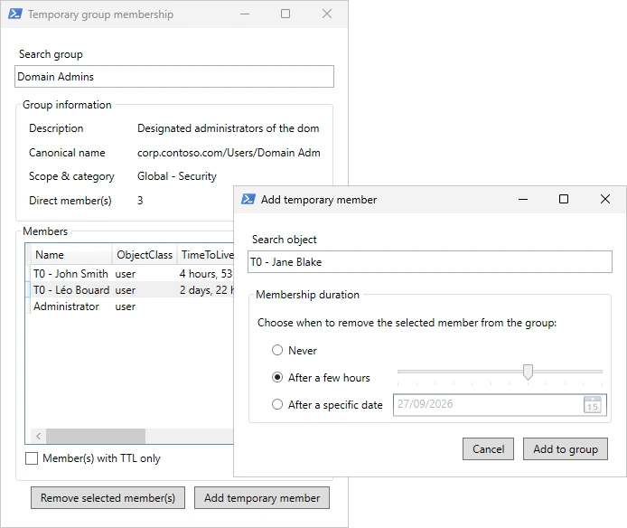

# TemporaryGroupMembership

A simple WPF interface to manage temporary group membership in Active Directory



## Prerequisites

To run properly, the script will need:

- The PowerShell Active Directory module version 1.0.1.0 or later (available since Windows Server 2016)
- The optional feature "Privileged Access Management" to be enabled in the current Active Directory forest

You can install the Active Directory module on Windows Server using this command:

```powershell
Install-WindowsFeature -Name RSAT-AD-PowerShell
```

You can enable the optional feature using this command:

```powershell
$splat = @{
    Identity = 'Privileged Access Management Feature'
    Scope = 'ForestOrConfigurationSet'
    Target = (Get-ADDomain).DnsRoot
}
Enable-ADOptionalFeature @splat
```

## Membership duration

You have three options for membership duration:

1. **Never** to add a permanent member to the group.
2. **For a few hours** to add a temporary member to the group for a duration between 1 and 12 hours (using the slider).
3. **Until a specific date** to add a temporary member to the group until a specific date (using the date picker), at midnight (local time).

## Improvements

If anyone knows how to sort a column using DataGrid in a PowerShell WPF-compatible user interface, please contact me or send a pull request! 😊
